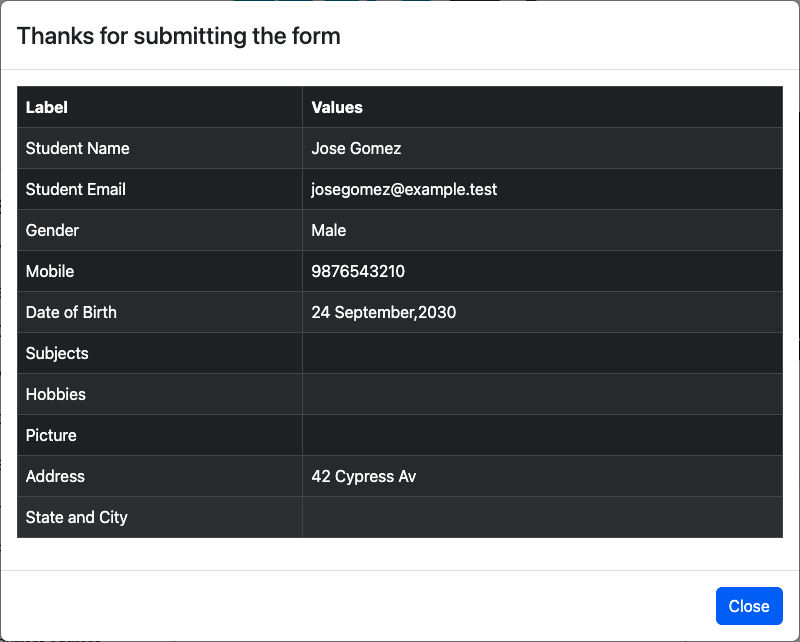

# Defects

## D-001: Practice Form accepts a future date of birth

**Page:** `/automation-practice-form`
**Covered by:** `TC-FORM-04`

### Steps to reproduce

1. Open https://demoqa.com/automation-practice-form.
2. Fill in the required fields: First Name, Last Name, Gender and a 10-digit Mobile number.
3. Click the Date of Birth field and pick a date in the future (I used 24 September 2030).
4. Click **Submit**.

### Expected

The form doesn't submit. Date of Birth is marked as invalid and the user stays on the page. Ideally the date picker doesn't offer future dates at all.

### Actual

The form submits. The "Thanks for submitting the form" modal shows `Date of Birth: 24 September,2030`.

### Severity and priority rationale

- **Severity: Medium.** Nothing crashes and the user isn't blocked, but the form accepts data that can't be true. In a real registration system, a birth date in the future would break anything that depends on age (eligibility, reports, age checks).
- **Priority: Low.** DemoQA is a practice site and no real user is affected. It's also a small fix (limit the picker to today and validate the field on submit), so it can go into a normal release instead of being rushed.

### Note on the test

The test asserts the current (wrong) behavior so the main suite stays green while the bug is open. When it's fixed, the test will fail. At that point it should be changed to assert that the future date is rejected.

**Evidence:** 
---

## D-002: State and City stay paired across a state change

**Page:** `/automation-practice-form`
**Covered by:** Not automated. Found during manual exploratory testing after the suite was written.

### Steps to reproduce

1. Open https://demoqa.com/automation-practice-form.
2. Scroll down to State and City.
3. Select State: **NCR**, then select City: **Delhi**.
4. Change State to **Rajasthan** (or **Uttar Pradesh**).
5. Fill in the required fields and click **Submit**.

### Expected

Changing the State clears the selected City, so the user has to pick a city that belongs to the new state.

### Actual

The City stays Delhi after the State changes. Submitting the form writes an impossible pair, such as Rajasthan and Delhi.

### Severity and priority rationale

- **Severity: Medium.** The user isn't blocked and nothing crashes, but the form silently saves a State and City that don't belong together. Nothing warns the user, so the bad pair only shows up later, in any data that uses the location, such as shipping, regional reports or filtering by state.
- **Priority: Low.** DemoQA is a practice site and no real user is affected. The fix is small too (clear or reload the City options when the State changes), so it can go into a normal release.
